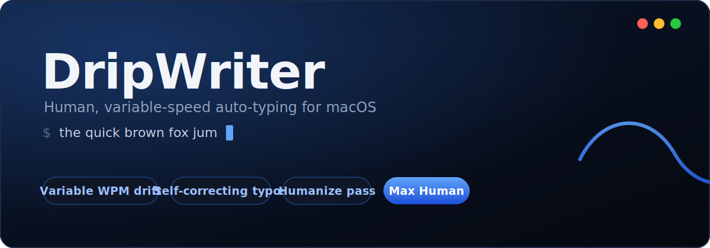

<div align="center">



# DripWriter

**Human, variable-speed auto-typing for macOS.**
Paste text, click any field, and it types like a person — drifting speed, pauses, fatigue, and self-corrected typos.

[](https://www.apple.com/macos/)
[](https://swift.org)
[](#)
[](#)
[](LICENSE)
[](https://github.com/NatePearson/DripWriter/releases/latest)

### ⬇ [**Download for macOS**](https://github.com/NatePearson/DripWriter/releases/latest/download/DripWriter.zip)  ·  [**Landing page**](https://natepearson.github.io/DripWriter/)

</div>

---

## What it is

DripWriter "drips" text into the field you choose — a LinkedIn box, a doc, an email, a form —
typing it the way a human actually does: the pace **wanders** between a min and max (it's never a
constant robotic rate), it pauses at punctuation, slows down as it "tires," and occasionally makes a
typo and fixes it. A built-in **Humanize** pass strips common AI writing tells before you send.

It's a single native app — **no Python, no runtime, no dependencies** — built with AppKit.

## Features

- **Variable-WPM engine** — speed is a random walk between your Min/Max sliders (with mean-reversion
  and occasional bursts). Inconsistent on purpose; that's what reads as human.
- **Self-correcting typos** — adjacent-key slips, doubled letters, transpositions, and
  "noticed-three-letters-later" corrections, all with believable backspacing.
- **Draft, then revise** — instead of typing perfectly top-to-bottom, it leaves small
  imperfections in the draft (a lowercase sentence-start, a mistyped word, a dropped comma),
  then **arrows back** to each one, fixes it, and returns to the end — like a real person
  re-reading and editing. The final text still matches your input exactly.
- **Three modes** — **Steady** (constant, clean), **Natural** (balanced), **Max Human** (the works).
- **✨ Humanize button** — an offline, rule-based port of the deterministic half of
  [blader/humanizer](https://github.com/blader/humanizer): dashes → commas, filler & hedging cuts,
  copula fixes, AI-vocab swaps, chatbot-artifact removal, curly-quote/emoji/bold cleanup.
- **Compact mode** — collapse to a tiny typer that stays out of the way.
- **Keyboard shortcuts**, a blue/black OLED-dark UI, and **ESC** to stop instantly.

## Modes

| Mode | Speed range | Mistakes | Feel |
|------|-------------|----------|------|
| **Steady** | constant | 0% | Clean, robotic — no drift or typos |
| **Natural** | 35–75 wpm | 3% | Balanced everyday human typing |
| **Max Human** | 15–110 wpm | 7% | Huge speed swings + **draft-then-revise**: re-reads, arrows back to fix typos / capitalization / punctuation, planning pauses |

## How it types like a human

Grounded in keystroke-logging writing research: real typing comes in **bursts** separated by
pauses, with the longest pauses (often **2 s+**) at sentence boundaries for *planning*, and
shorter, more frequent pauses during *revision*. Gaps under ~200 ms are motor, not cognitive.

So beyond varying speed, **Max Human / draft-then-revise** writes a rough draft and then goes back
to edit it. A real keystroke trace from the planner (`→`/`←` = cursor, `⌫` = delete, `·` = pause):

```
The fat sat on the mat, and it was y⌫happy. thd⌫e end.·[←×7]·⌫T·[←×38]·⌫c·[→×45]
  → "The cat sat on the mat, and it was happy. The end."
```

It typed "fat" (left wrong), fixed "happy"/"the" inline, left "the end" lowercase — then re-read,
arrowed back to capitalize "The", went further back to fix "cat", and returned to the end. The
final text always equals your input (verified across 7,200 randomized runs).

## Keyboard shortcuts

| Shortcut | Action |
|----------|--------|
| `⌘1` / `⌘2` / `⌘3` | Steady / Natural / Max Human |
| `⌘K` | Toggle Compact / Expand |
| `⌘⇧H` | Humanize the text |
| `⌘Z` | Undo (including a Humanize pass) |
| `ESC` | Stop typing |

## Download (prebuilt)

Grab the latest **[DripWriter.zip](https://github.com/NatePearson/DripWriter/releases/latest/download/DripWriter.zip)**,
unzip it, and move **DripWriter.app** to Applications. Requires **macOS 13+** — universal (Intel & Apple Silicon).

Because it's open-source and not notarized by Apple, the first launch needs one step — **right-click → Open → Open**
(or System Settings → Privacy & Security → **Open Anyway**, or
`xattr -dr com.apple.quarantine /Applications/DripWriter.app`). Then grant Accessibility when prompted.

## Install & build (from source)

Requires the Xcode Command Line Tools (`xcode-select --install`).

```bash
git clone https://github.com/NatePearson/DripWriter.git
cd DripWriter
./build.sh          # compiles Sources/*.swift, assembles + ad-hoc-signs DripWriter.app
open DripWriter.app
```

### Grant Accessibility (one time)
DripWriter sends keystrokes to other apps, so macOS requires Accessibility permission.

1. Press **Start typing** once — it opens the right settings pane for you.
2. **System Settings → Privacy & Security → Accessibility → switch DripWriter ON**.
3. It **auto-detects** the grant — no restart, no repeated prompts.

> Rebuilding changes the ad-hoc signature, so you may need to re-enable it.
> Clear a stale entry with `tccutil reset Accessibility com.natep.dripwriter`.

## How the Humanize pass works

It performs only the **deterministic** fixes that are safe without changing meaning:

- em/en dashes → commas (number ranges kept as hyphens)
- filler ("in order to" → "to", "it is important to note that" → cut)
- hedging ("could potentially possibly" → "may")
- copula-avoidance ("serves as" → "is", "boasts a" → "has a")
- overused AI words ("utilize"/"leverage" → "use", "delve into" → "examine")
- signposting & chatbot artifacts ("Let's dive in", "I hope this helps!") → cut
- curly quotes → straight, emojis removed, **bold** markdown unwrapped, sentences re-capitalized

It deliberately does **not** attempt semantic rewrites (significance inflation, vague attributions,
rule-of-three, etc.) — those need a real LLM. Use it as a fast first pass, then read it over.

## Good to know

- **Won't work in password fields** or some hardened apps (they reject synthetic keystrokes by design).
  Normal text fields, browsers, docs, and chat boxes are fine.
- If you run **Grammarly Desktop**, it may try to "correct" the deliberate typos in your target field —
  pause it while drip-typing if the output looks off.

## Project layout

```
Sources/main.swift       UI + variable-WPM typing engine + custom AppKit views
Sources/Humanizer.swift  the Humanize ruleset (independently testable)
build.sh                 compile + bundle + ad-hoc sign
docs/                    GitHub Pages landing page
```

## Credits

- Humanize ruleset ported from [blader/humanizer](https://github.com/blader/humanizer).
- Built for typing demos, screen recordings, form testing, and natural-looking text entry.

## License

[MIT](LICENSE) © 2026 Nate Pearson
